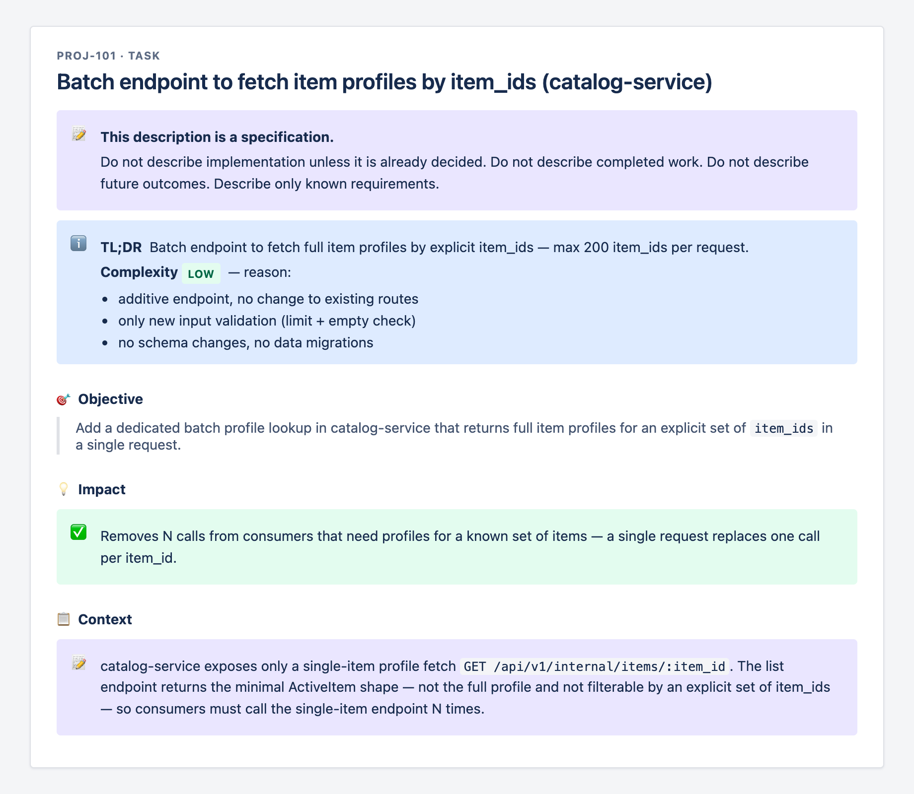
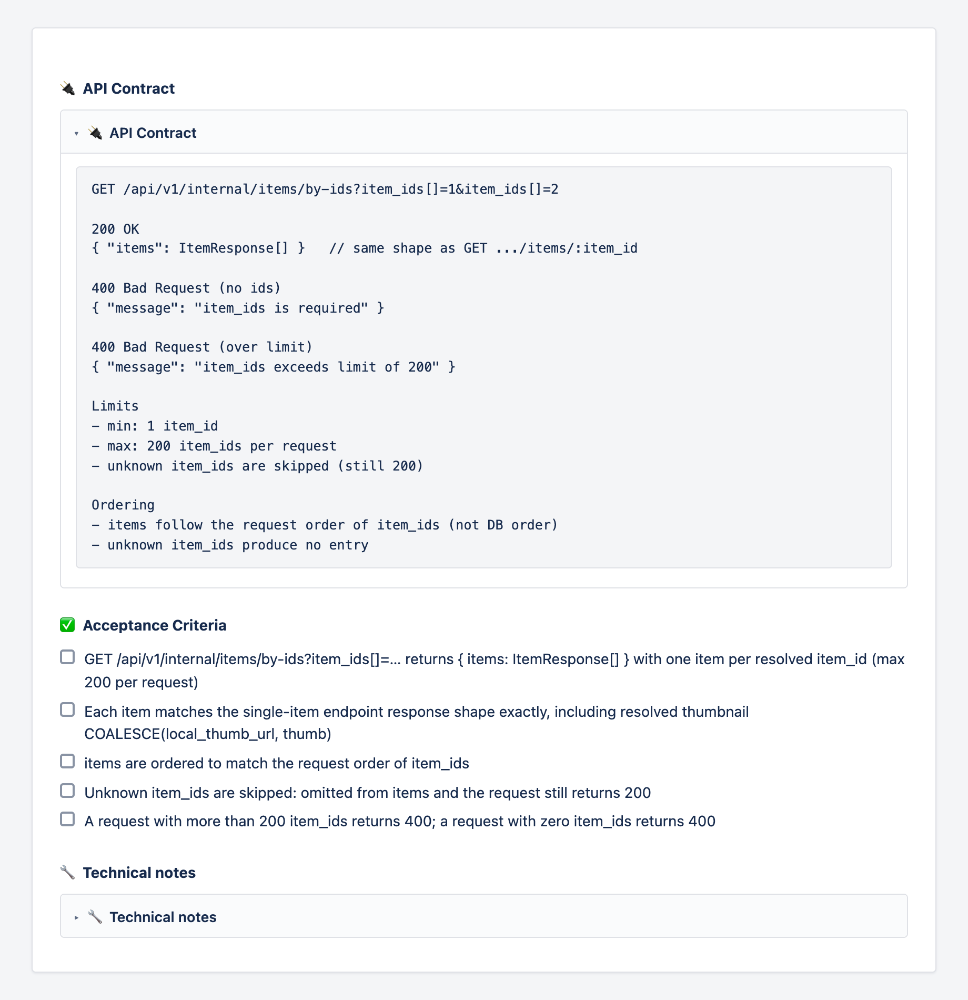
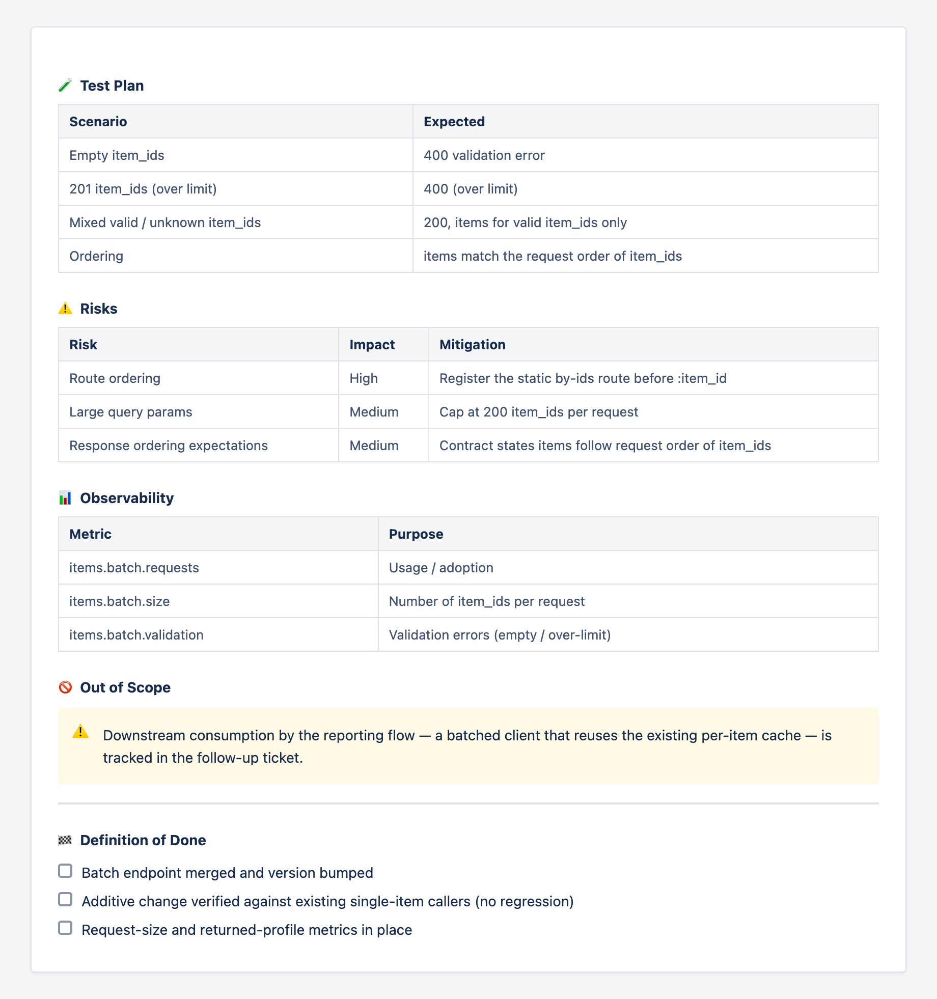

# claude-jira-skills

A growing collection of [Claude](https://claude.com/claude-code) skills for Jira. The flagship
`jira-create` skill turns plain requests into **dashboard-style tickets** using Atlassian Document
Format (ADF) — colored panels, status lozenges, collapsible sections, interactive checklists, and
tables — instead of flat markdown. More skills (search, triage, sprint reporting) are on the way.

All skills run on the official **Atlassian Remote MCP**, so they work anywhere Claude supports MCP.

## Skills

| Skill         | What it does                                                                 |
| ------------- | ---------------------------------------------------------------------------- |
| `jira-create` | Create rich, dashboard-style Jira issues (Task, Bug, Story, Epic, Subtask)   |
| `r-assess`    | Assess a task's **R responsibility rating** (`R0`–`R3+`) from Blast Radius / Reversibility / Detectability, propose buy-downs, and **self-calibrate** from a local journal of past assessments and human overrides |

## What a ticket looks like

The skill produces spec-first, consistently structured tickets. Screenshots below use a
generic example (no real project data).

**Header — specification notice, TL;DR, Complexity (with reason), Objective, Impact, Context**



**Collapsible API Contract (with error cases) + testable Acceptance Criteria**



**Test Plan, Risks, and Observability as tables + Out of Scope + Definition of Done**



## Layout

```
claude-jira-skills/
├── skills/
│   ├── jira-create/
│   │   ├── SKILL.md
│   │   └── templates/        # ready-to-fill ADF documents
│   │       ├── task.adf.json
│   │       ├── bug.adf.json
│   │       └── story.adf.json
│   └── r-assess/
│       ├── SKILL.md          # the workflow: axes → matrix → buy-down → record
│       ├── references/
│       │   └── framework.md  # full R framework (stable — the part that doesn't learn)
│       └── calibration/      # local knowledge (evolving — the part that does)
│           ├── CALIBRATION.md  # team axis anchors, precedents, ✳-cell case law, limits
│           └── journal.jsonl   # append-only log of every assessment
└── shared/
    └── adf-cheatsheet.md      # reusable ADF reference for any skill
```

## Install

Copy a skill into your Claude skills directory (project- or user-level):

```bash
# project-level
cp -r skills/jira-create <your-repo>/.claude/skills/

# or user-level (available everywhere)
cp -r skills/jira-create ~/.claude/skills/
```

**`r-assess` should be symlinked, not copied** — it writes to its own `calibration/` on every
assessment, and a symlink keeps those writes in this repo where they are git-reviewable (a copy
silently diverges):

```bash
ln -s "$(pwd)/skills/r-assess" <your-repo>/.claude/skills/r-assess
```

The skills load their `templates/`, `references/`, `calibration/`, and
`../../shared/adf-cheatsheet.md` on demand.

## Requirements

- Claude with the official **Atlassian Remote MCP** connected (`mcp__atlassian__*` tools).
- A Jira Cloud site you can create issues in.

## Why ADF?

Markdown descriptions give you headings, lists, and code blocks. ADF unlocks the parts of Jira that
make a ticket actually scannable: colored callout **panels**, **status lozenges** (the badge pills),
**collapsible** sections, **interactive checklists**, **decision lists**, smart **date** pills, and
real **tables**. See [`shared/adf-cheatsheet.md`](./shared/adf-cheatsheet.md).
